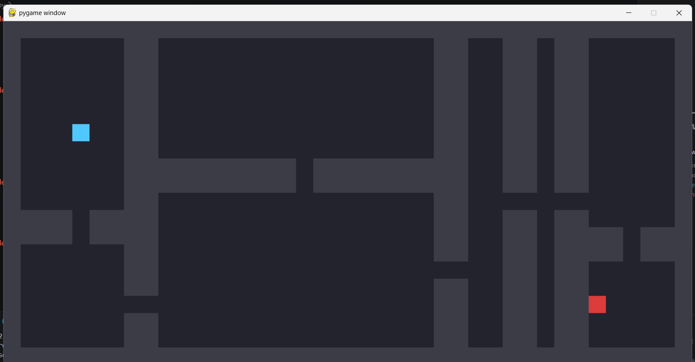

# Deadlock



A roguelike dungeon crawler built from scratch in Python — procedurally
generated dungeons, grid-based combat, A* enemy pathfinding, and local
run persistence, with more systems (a backend and a web leaderboard)
planned as the project grows.

## Features
- Grid-based movement and bump-to-attack combat
- Procedurally generated dungeons using recursive Binary Space
  Partitioning (BSP) — a new layout every run, rooms connected by
  automatically carved corridors
- Enemy AI with A* pathfinding — navigates around walls and corners
  instead of getting stuck on them
- Local run history via SQLite — tracks enemies killed and survival
  per run, shown on the game-over screen
- Player/enemy HP, death, and a game-over state with a quick restart


## Tech stack
Python, Pygame, FastAPI, PostgreSQL, React, TypeScript

## Running the full stack
This project now has three parts, each run in its own terminal:

1. API: `uvicorn api:app --reload`
2. Game: `python main.py`
3. Web leaderboard: `cd frontend && npm run dev` — then open the
   printed local URL (e.g. http://localhost:5173) in a browser


## Setup
```bash
python -m venv venv
source venv/bin/activate      # Windows: venv\Scripts\activate
pip install -r requirements.txt
```

## Running
This project now has two parts that run separately:

1. Start the API (Terminal 1):
```bash
uvicorn api:app --reload
```

2. Start the game (Terminal 2):
```bash
python main.py
```

## Controls
- WASD to move
- Walk into an enemy to attack it (bump-to-attack — takes 2 hits to kill)
- Kill the enemy to clear the floor, or die trying — either way, `R` starts a new run

## Architecture
See `DESIGN.md` for the full design doc: architecture diagram, build
phases, implementation notes per phase, and current status.


## What I learned
- **Recursion**, building the dungeon generator (BSP): splitting a
  rectangle into two, then recursively splitting each of those, until
  pieces are small enough to become rooms. First time implementing a
  recursive algorithm from scratch rather than just using one.
- **Graph search / A***: implementing pathfinding taught me why a
  priority queue matters — always expanding the most promising tile
  (lowest `f = g + h`) instead of just the nearest one is what makes A*
  smarter than a plain breadth-first search.
- **Debugging by isolation**: when the enemy AI silently stopped
  working, tracing it back to a single misplaced `else` block (attached
  to the wrong `if`) taught me to test logic in small, isolated pieces
  rather than assuming a big change is correct just because it runs
  without crashing.
- **SQLite / basic persistence**: first time using a real database
  instead of just variables in memory — INSERT/SELECT against a local
  `.db` file. This is the same pattern the planned PostgreSQL backend
  (Phase 5) will use, just local instead of over a network.
- **Git workflow**: committing incrementally after each working piece
  (not just once at the end) makes the project's history actually show
  how it was built, not just the final result.